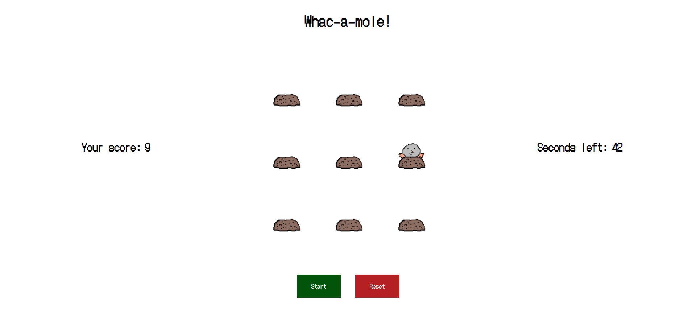

<h1 align="center"> Whac-a-Mole</h1>

<h2 align="center">
    
</h2>

 

 

---

<h2>Vanilla JavaScript Whac-a-mole</h2>

 

&nbsp;&nbsp;&nbsp;&nbsp;<strong>Whac-a-mole</strong> is an arcade game invented in 1975 and licensed to Bandai in 1977. The idea is that the player hits the mole as many times as possible before the times runs out. The mole apears randomly in one of the several holes.

 

---

<h2>Preview</h2>

<h2 align="center">
    
</h2>